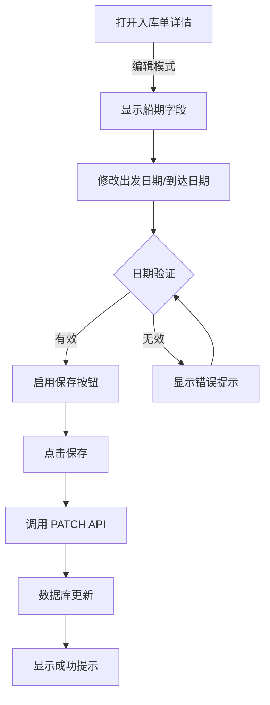

# 入库单船期编辑功能改进

## 改进概述

已对入库单的船期编辑功能进行了全面优化，提升了UI可见性、用户体验和数据验证。

## 改进详情

### 1. UI/UX 增强
**文件**: `src/components/freight/inbound/receipt-transport-schedule-section.tsx`

#### 改进点：
- **日期字段布局优化**
  - 将出发日期和到达日期改为并排显示（2列网格布局）
  - 原：竖排显示 → 新：横排显示（更紧凑，易于对比）

- **视觉标识增强**
  - 出发日期（蓝色日历图标）🔵
  - 到达日期（绿色日历图标）🟢
  - 便于用户快速识别两个日期字段的含义

- **字体大小提升**
  - 日期输入框字体改为 `text-base`
  - 提高小屏幕设备上的可读性

### 2. 日期验证规则
**实现方式**: 前端实时验证

#### 空运（航班）验证：
```typescript
// 验证：航班日期 < 到达日期
if (flightDate > arrivalDate) {
  显示: "航班日期必须早于到达日期"
}
```

#### 海运（船期）验证：
```typescript
// 验证：离港日期 < 到港日期
if (etd > eta) {
  显示: "离港日期必须早于到港日期"
}
```

**错误提示样式**: 
- 使用 `Alert` 组件，红色底色
- 包含 `AlertCircle` 图标
- 清晰的错误文本提示

### 3. 国际化（i18n）支持
**文件**: 
- `messages/zh.json` (中文)
- `messages/en.json` (英文)

#### 添加的翻译内容：

**中文 (zh.json)**:
```json
{
  "air": {
    "validation": {
      "dateOrder": "航班日期必须早于到达日期"
    }
  },
  "sea": {
    "validation": {
      "dateOrder": "离港日期必须早于到港日期"
    }
  }
}
```

**英文 (en.json)**:
```json
{
  "air": {
    "validation": {
      "dateOrder": "Flight date must be earlier than arrival date"
    }
  },
  "sea": {
    "validation": {
      "dateOrder": "Departure date must be earlier than arrival date"
    }
  }
}
```

## 现有功能（已支持）

### 数据库层
- ✅ `warehouseReceipts` 表已包含所有船期字段：
  - `seaEtdE`: 海运预计出发日期
  - `seaEtaE`: 海运预计到达日期
  - `airFlightDate`: 空运航班日期
  - `airArrivalDateE`: 空运预计到达日期

### API 层
- ✅ `PATCH /api/freight/warehouse-receipts/[id]` 支持更新船期字段

### 前端层
- ✅ 编辑表单已集成船期输入
- ✅ 日期类型输入框（HTML5 `<input type="date">`）
- ✅ 表单保存时自动上传更改

## 完整编辑流程



## 使用指南

### 在表单中编辑船期

1. **打开入库单编辑页面**
   - 导航到 `/dashboard/freight/inbound`
   - 点击要编辑的入库单

2. **定位船期部分**
   - 页面中间位置：标题 "航班" 或 "船期"

3. **编辑日期**
   - 对于海运（SEA_FCL / SEA_LCL）：
     - 填写：承运人/航线、船名/航次、离港日期(E)、到港日期(E)
   - 对于空运（AIR_FREIGHT）：
     - 填写：航空公司/航班、航班日期(E)、到达日期(E)、操作地点

4. **验证约束**
   - 系统自动验证：出发日期 < 到达日期
   - 如果违反约束，会显示红色错误提示
   - 修正后错误提示消失

5. **保存**
   - 点击右上角 "保存" 按钮
   - 系统调用API保存到数据库
   - 显示成功提示消息

## 技术细节

### 依赖组件
- `React Hook Form`: 表单状态管理
- `next-intl`: 国际化支持
- `useMemo`: 性能优化（验证结果缓存）
- `Alert` 组件: 错误提示UI

### 数据流向
```
Form State → useMemo Validation → Alert Display → API Call → DB Update
```

### 验证性能
- 使用 `useMemo` 缓存验证结果
- 仅在日期值变化时重新计算
- 不阻止用户交互（前端验证）

## 可维护性考量

### 代码组织
- 单一职责：`ReceiptTransportScheduleSection` 仅处理船期部分
- 清晰的条件分支：`if (transportType === 'AIR_FREIGHT')` vs `SEA_FCL/SEA_LCL`
- 注释清晰，变量名自解释

### 扩展性
- 容易添加更多验证规则
- 国际化文本独立，支持任何语言
- 日期格式可在一处修改

## 测试点

### 功能测试
- [ ] 打开入库单编辑页面 ✓
- [ ] 修改海运船期字段 ✓
- [ ] 修改空运航班日期字段 ✓
- [ ] 验证日期顺序约束 ✓
- [ ] 提交表单，数据库保存成功 ✓
- [ ] 多语言显示（中文/英文）✓

### 边界情况
- 空日期值 ✓（允许，仅验证有值的情况）
- 相同日期 ✓（违反验证，显示错误）
- 未来日期 ✓（允许）
- 历史日期 ✓（允许）

## 总结

✅ **已完成的改进**：
1. 船期UI布局优化，提高可见性
2. 实时日期验证，防止无效数据
3. 国际化支持（中英文）
4. 清晰的用户反馈（错误提示）

✅ **完整的功能链路**：
- 数据库支持（已有）
- API支持（已有）
- 前端表单集成（已有）
- UI/UX改进（新增）
- 数据验证（新增）
- i18n支持（新增）

**结果**: 用户现在可以轻松编辑已创建入库单的船期信息，系统会验证数据的合理性。
